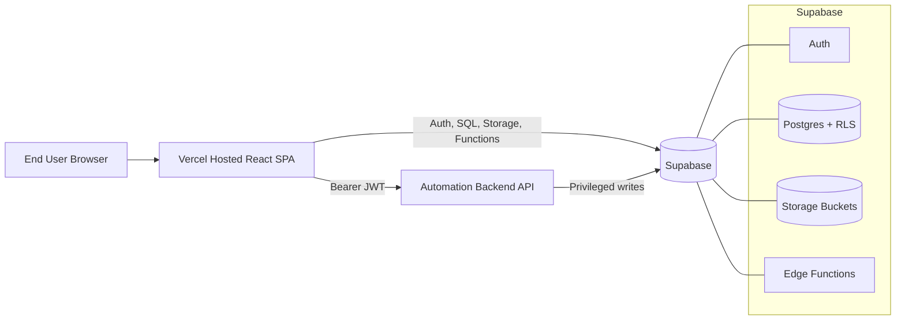
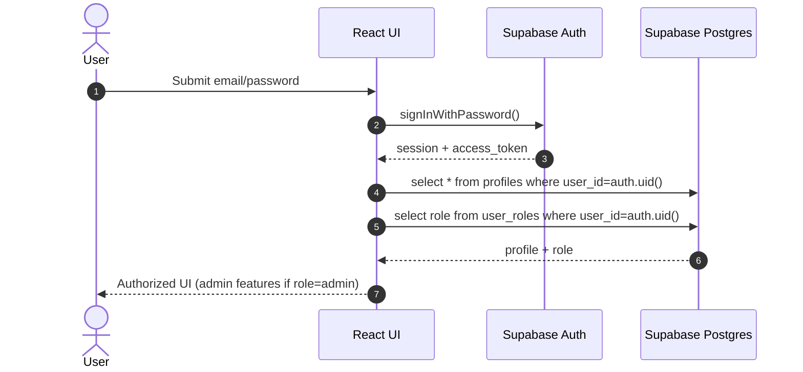
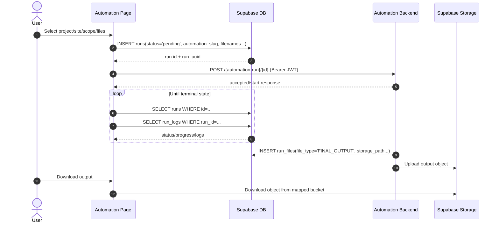
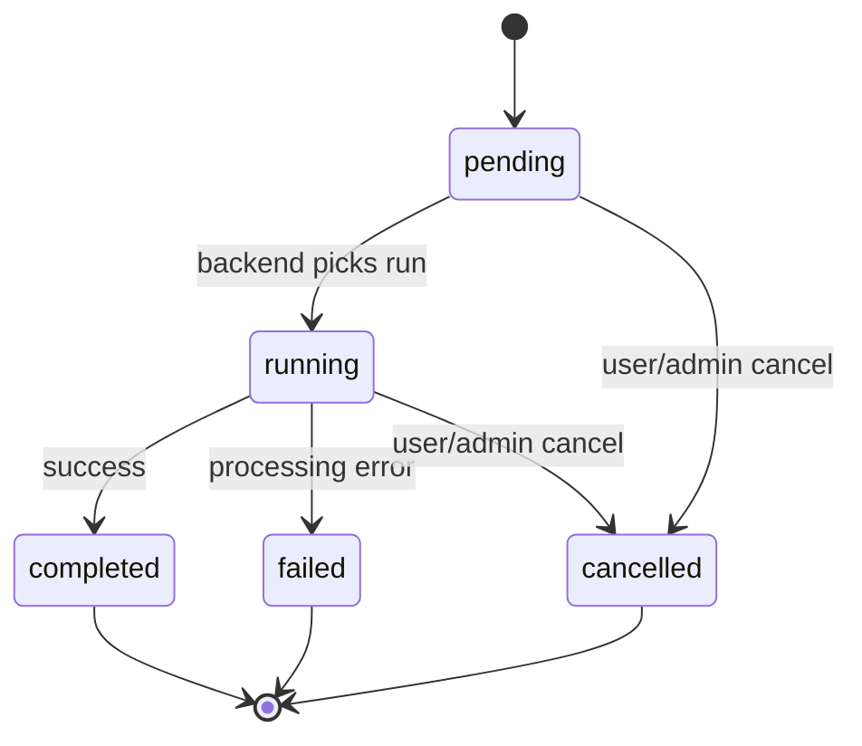
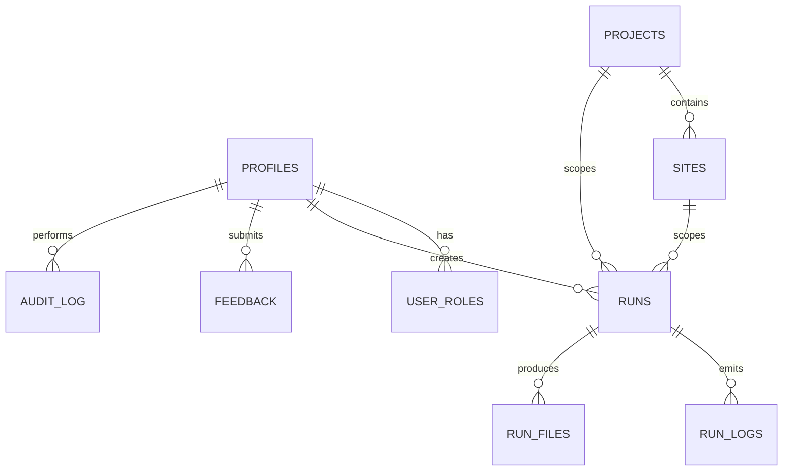
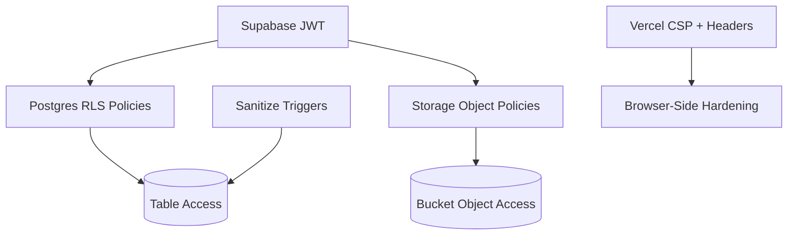

# Automation Hub Platform Documentation

## 1. Purpose and Scope
This document describes the end-to-end architecture and behavior of the Automation Hub platform in this repository. It is intended for:
- engineers onboarding to the codebase
- backend/integration teams consuming run metadata
- security reviewers validating access controls
- operators troubleshooting runs and file movement

It covers:
- frontend architecture and route model
- Supabase schema, RLS and storage policies
- automation run lifecycle across PL/PDP/PP flows
- backend API contracts used by the UI
- operational runbooks and known implementation gaps

## 2. Platform Snapshot

### 2.1 What the Platform Does
Automation Hub is an authenticated internal application for triggering and monitoring data pipelines:
- `pl-conso`
- `pl-input`
- `pdp-conso`
- `pp-conso`

The app does not execute heavy processing itself. It orchestrates execution by:
1. creating a `runs` row in Supabase
2. calling external backend endpoints with a Supabase JWT
3. polling run status/logs and exposing output download

### 2.2 Core Tech Stack
- Frontend: Vite, React 18, TypeScript, React Router, TanStack Query
- UI: Tailwind, shadcn/radix components, lucide icons
- Identity/data plane: Supabase Auth + Postgres + Storage + Edge Functions
- Hosting: Vercel frontend, external backend (Render URL by default)

### 2.3 Deployment Topology Diagram

## 3. Frontend Architecture

### 3.1 Application Composition
- `src/main.tsx` mounts SPA.
- `src/App.tsx` configures route tree, providers, and route guards.
- `AuthProvider` (`src/hooks/useAuth.tsx`) resolves session/user/profile/role.
- `ProtectedRoute` enforces authentication and optional admin checks.
- `AppLayout` composes `AppHeader`, `AppSidebar`, `AppFooter`.

### 3.2 Route Map
Public:
- `/login`

Authenticated:
- `/` home launcher
- `/automation/pl-conso`
- `/automation/pl-input`
- `/automation/pdp-conso`
- `/automation/pp-conso`
- `/downloads`
- `/analytics`

Admin-only (`requireAdmin`):
- `/admin/users`
- `/admin/files`
- `/admin/analytics`
- `/admin/audit`
- `/admin/feedback`
- `/profile` (currently admin-gated)
- `/feedback` (currently admin-gated)

### 3.3 Auth and Session Lifecycle
1. Login page calls `supabase.auth.signInWithPassword`.
2. `useAuth` listener updates `session` and `user`.
3. `useAuth` loads:
- `profiles` by `user_id`
- `user_roles` by `user_id`
4. `isAdmin` is derived from role.
5. Protected routes redirect to `/login` when no user.
6. Admin routes redirect to `/` when non-admin.

Domain constraint in UI:
- only `@merkle.com` and `@dentsu.com` are accepted at login/signup form level

### 3.4 Frontend-to-Backend Client
`src/lib/backendApi.ts`:
- reads current Supabase session token
- attaches `Authorization: Bearer <access_token>`
- resolves URL from `VITE_BACKEND_URL` with default fallback
- throws on non-2xx responses

## 4. End-to-End Flow Diagrams

### 4.1 Authentication Sequence

### 4.2 Run Creation and Execution Sequence

### 4.3 Run Status State Machine

## 5. Automation Workflows (Detailed)

### 5.1 Shared Run Metadata Contract
Common fields written from UI into `runs`:
- `user_id`
- `project_id`
- `site_id`
- `scope`
- `status` (initially `pending`)
- `automation_slug`
- automation-specific filename fields (`op_filename`, `ip_filename`, `master_filename`, `ae_filename`)

### 5.2 Workflow Matrix
| Workflow | `automation_slug` | Start Endpoint | Rerun Endpoint | Output Bucket | Key Input Buckets |
|---|---|---|---|---|---|
| PL Conso | `pl-conso` | `POST /run/{id}` | `POST /run/{id}/rerun` | `run-outputs` | `crawl-input`, `masters`, `input_files` table refs |
| PL Input | `pl-input` | `POST /input-run/{id}` | `POST /input-run/{id}/rerun` | `input-creation-output` | `input-creation-bussiness-file`, `input-creation-crawl-team-file`, `input-creation-master` |
| PDP Conso | `pdp-conso` | `POST /pdp-run/{id}` | `POST /pdp-run/{id}/rerun` | `pdp-run-output` | `pdp-input`, `pdp-crawl-input`, `pdp-masters` |
| PP Conso | `pp-conso` | `POST /pp-run/{id}` | `POST /pp-run/{id}/rerun` | `pp-run-output` | `pp-input`, `pp-review-input`, `pp-reference`, `pp-ae-checks`, optional `pp-cache` |

All workflows also use:
- Cancel endpoint: `POST /runs/{id}/cancel`

### 5.3 PL Conso Specifics
Validation and source selection:
- OP file comes from `input_files` (`file_type = CRAWL`) and uses `storage_path`.
- IP file comes from `crawl-input`.
- Master file comes from `masters`.
- UI contains strict filename validation for some project/site/scope combinations.

Run payload shape:
- `op_filename = <input_files.storage_path>`
- `ip_filename = <crawl-input object name>`
- `master_filename = <masters object name>`
- `automation_slug = 'pl-conso'`

### 5.4 PL Input Specifics
Sources:
- OP/source from `input-creation-bussiness-file`
- IP from `input-creation-crawl-team-file`
- Master from `input-creation-master`

Run payload shape:
- `op_filename = <selected business file>`
- `ip_filename = <selected crawl-team file>`
- `master_filename = <selected master file>`
- `automation_slug = 'pl-input'`

### 5.5 PDP Conso Specifics
Sources:
- OP from `pdp-input`
- IP from `pdp-crawl-input`
- Master from `pdp-masters`

Run payload shape:
- `op_filename = <pdp-input object>`
- `ip_filename = <pdp-crawl-input object>`
- `master_filename = <pdp-masters object>`
- `automation_slug = 'pdp-conso'`

### 5.6 PP Conso Specifics
Modes:
- `fresh` mode requires source file from `pp-input`
- `revalidation` mode requires review file from `pp-review-input`

Additional behavior:
- Reference file from `pp-reference` is mandatory.
- AE template file from `pp-ae-checks` is conditionally required depending on selected source pattern list.
- Cache bucket `pp-cache` exists for cached/recalculated template artifacts.

Run payload shape:
- `op_filename = <pp-input object or null>`
- `ip_filename = <pp-review-input object or null>`
- `master_filename = <pp-reference object>`
- `ae_filename = <pp-ae-checks object or null>`
- `automation_slug = 'pp-conso'`

## 6. Data Model and Schema

### 6.1 Logical Domain Model

### 6.2 Core Tables
- `profiles`: user metadata; `user_id` unique reference to `auth.users`.
- `user_roles`: role entries using enum `app_role`.
- `projects`: business project catalog.
- `sites`: child sites under each project.
- `runs`: automation run metadata and state.
- `run_logs`: log stream entries per run.
- `run_files`: output and artifact records per run.
- `input_files`: admin-managed crawl inputs for PL Conso.
- `audit_log`: action events for governance/admin traceability.
- `feedback`: user feedback entries with optional attachment path.

### 6.3 `runs` Table Semantics
Identity and ownership:
- `id` (UUID PK), `run_uuid` (short unique id for display)
- `user_id`, `project_id`, `site_id`

Execution state:
- `status` (`pending`/`running`/`completed`/`failed`/`cancelled`)
- `progress_percent`
- `start_time`, `end_time`
- `created_at`

File and automation routing metadata:
- legacy/compat: `crawl_filename`, `master_filename`
- current: `op_filename`, `ip_filename`, `ae_filename`
- route key: `automation_slug`

### 6.4 Enums and Functions
Enums:
- `app_role`: `admin | user`
- `run_status`: `pending | running | completed | failed | cancelled`

Functions:
- `public.has_role(_user_id, _role)` security-definer with `row_security = off` in hardened version.
- `public.get_user_role(_user_id)` helper role resolver.

### 6.5 Constraints and Indexes
- `runs_automation_slug_check`: allows `pl-conso`, `pl-input`, `pdp-conso`, `pp-conso`, or `NULL`.
- `idx_runs_automation_slug_created_at`: supports history filters.
- `idx_runs_ae_filename`: supports PP template-linked filtering/debugging.

## 7. Storage Architecture

### 7.1 Bucket Inventory
Generic:
- `input-files`
- `run-outputs`
- `attachment-feedback`

PL Input:
- `input-creation-output`
- `input-creation-master`
- `input-creation-crawl-team-file`
- `input-creation-bussiness-file`

PL Conso:
- `crawl-input`
- `masters`

PDP:
- `pdp-input`
- `pdp-crawl-input`
- `pdp-masters`
- `pdp-run-output`

PP:
- `pp-input`
- `pp-review-input`
- `pp-reference`
- `pp-ae-checks`
- `pp-run-output`
- `pp-cache`

### 7.2 Storage Policy Model
Policy families on `storage.objects`:
- `storage_read_authenticated_app_buckets`: authenticated read allowlist.
- `storage_insert_authenticated_limited`: authenticated write allowlist.
- `storage_delete_owner_or_admin`: delete by owner or admin.
- `storage_update_owner_or_admin`: update by owner or admin.
- PP template hardening:
  - `storage_insert_admin_pp_ae_checks`
  - `storage_update_admin_pp_ae_checks`
  - `storage_delete_admin_pp_ae_checks`

All app buckets are enforced private (`public = false`).

### 7.3 Download Resolution Path
The Downloads page uses `download_view` and maps output buckets by `automation_slug`:
- `pl-conso` -> `run-outputs`
- `pl-input` -> `input-creation-output`
- `pdp-conso` -> `pdp-run-output`
- `pp-conso` -> `pp-run-output`

## 8. Security and Access Control

### 8.1 RLS Strategy
At a high level:
- shared catalog data (`projects`, `sites`): authenticated read
- user-owned data (`profiles`, `runs`, `run_logs`, `run_files`, `feedback`): owner-or-admin
- privileged tables (`user_roles`, `audit_log`, some mutating ops): admin-only

### 8.2 Security Migration Progression
Major hardening themes introduced by later migrations:
- removal of permissive legacy policies
- force-RLS and explicit `anon` revocations for sensitive tables
- rewrite of `has_role` to avoid recursive/unsafe RLS evaluation
- private storage enforcement and policy allowlisting
- XSS mitigation with sanitization triggers for `profiles` and `feedback`

### 8.3 Security Controls Diagram

### 8.4 Client and Edge Security Notes
- `backendApi.ts` requires access token before backend calls.
- Vercel security headers include CSP, `X-Frame-Options: DENY`, `nosniff`, strict referrer policy.
- Admin actions are routed through Supabase Edge Functions.
- Edge function CORS is currently permissive (`Access-Control-Allow-Origin: *`), relying on auth enforcement.

## 9. Admin Modules

### 9.1 User Management (`/admin/users`)
Capabilities:
- update role by replacing `user_roles` entries
- reset password via `update-user-password` function
- disable/enable account via `disable-user-account`
- create user via `create-user`

### 9.2 File Management (`/admin/files`)
Capabilities:
- upload/download/delete crawl inputs in `input-files` + `input_files` table
- upload/download master files from `masters`

### 9.3 Analytics (`/admin/analytics` and `/analytics`)
Capabilities:
- run KPIs: total, success rate, failed, avg duration
- filtering by date/project/user/automation
- CSV export
- AI PDF report download from `GET /run/{id}/ai-report-pdf`

### 9.4 Audit and Feedback
- `AdminAuditPage`: reads `audit_log` (latest 200)
- `AdminFeedbackPage`: reads feedback and opens signed attachment URLs from `attachment-feedback`

## 10. Backend API Contract (UI-Observed)

### 10.1 Endpoints Triggered by UI
- `POST /run/{id}`
- `POST /run/{id}/rerun`
- `GET /run/{id}/logs`
- `POST /input-run/{id}`
- `POST /input-run/{id}/rerun`
- `POST /pdp-run/{id}`
- `POST /pdp-run/{id}/rerun`
- `POST /pp-run/{id}`
- `POST /pp-run/{id}/rerun`
- `POST /runs/{id}/cancel`
- `GET /run/{id}/ai-report-pdf`

### 10.2 Backend Auth Model
Every request from frontend to backend includes Supabase access token as Bearer token. Backend is expected to:
- verify token signature and claims
- authorize run operation for current user/role
- use privileged credentials for internal DB/storage writes as needed

## 11. Environment and Deployment

### 11.1 Frontend Environment Variables
- `VITE_SUPABASE_URL`
- `VITE_SUPABASE_PUBLISHABLE_KEY`
- `VITE_BACKEND_URL` (optional, defaults to Render URL)

### 11.2 Build and Runtime Commands
- `npm run dev`
- `npm run build`
- `npm run preview`
- `npm run test`
- `npm run lint`

### 11.3 Supabase Project Linkage
Local `supabase/config.toml` contains `project_id = "zzekxhobrxdibqpxjvrv"`.

## 12. Repository Map (Engineering-Oriented)
- `src/App.tsx`: route registration and top-level providers
- `src/hooks/useAuth.tsx`: auth/session/profile/role state model
- `src/lib/backendApi.ts`: backend HTTP wrapper with JWT
- `src/pages/*`: workflow and admin screens
- `src/components/layout/*`: shell composition
- `src/integrations/supabase/client.ts`: Supabase client bootstrap
- `src/integrations/supabase/types.ts`: generated DB type map
- `supabase/migrations/*.sql`: schema + RLS + storage policy evolution
- `supabase/functions/*`: Deno edge functions for user administration

## 13. Operational Runbooks

### 13.1 Trigger a Run
1. Select project/site/scope and required files.
2. Create run row in `runs` with `pending` status.
3. Invoke matching backend start endpoint.
4. Poll run status/logs until terminal.
5. Download output by resolving `run_files` record and bucket mapping.

### 13.2 Cancel a Run
1. Update run in DB to:
- `status = cancelled`
- `start_time = null`
- `end_time = null`
- `progress_percent = 0`
2. Call `POST /runs/{id}/cancel`.

### 13.3 Rerun
1. Call automation-specific rerun endpoint.
2. Backend reprocesses the run.
3. UI refreshes logs and status.

### 13.4 Troubleshooting Checklist
- Run does not start:
  - verify `runs` insert success
  - verify backend endpoint/network reachable
  - verify Bearer token exists and not expired
- Logs missing:
  - confirm backend writes `run_logs`
  - verify RLS visibility (owner/admin)
- Download failing:
  - confirm `run_files` row exists (`FINAL_OUTPUT`)
  - confirm bucket mapping for `automation_slug`
  - confirm storage object path exists

## 14. Known Gaps and Technical Debt
1. `create-user` edge function source is malformed and requires repair before reliable deployment/execution.
2. Type drift: generated `src/integrations/supabase/types.ts` is missing newer `runs` columns (`automation_slug`, `op_filename`, `ip_filename`) used in UI and migrations.
3. Schema object drift: UI references `download_view` and `run_ai_reports`, but repository migrations do not currently define them.
4. Route policy mismatch: `/profile` and `/feedback` are admin-only in route guard though they are user-centric features.
5. Duplicate analytics page implementations (`src/pages/AdminAnalyticsPage.tsx` and `src/pages/admin/AdminAnalyticsPage.tsx`).

## 15. Recommended Next Documentation Additions
- Add backend OpenAPI snapshot (private/internal) with request/response schemas.
- Add explicit DDL for `download_view` and `run_ai_reports`.
- Add SLA/SLO definitions for run completion latency and failure rate.
- Add incident playbook for failed run retries and manual backfills.
