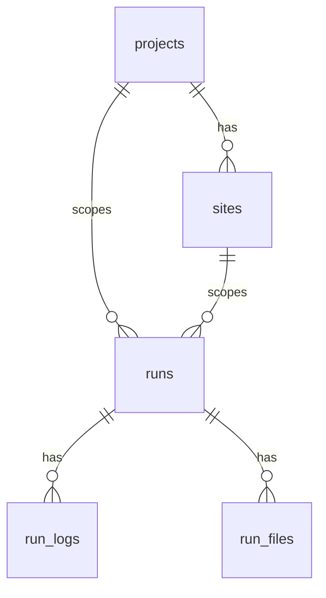

# Data Dictionary

## 1. Core Entities

### `profiles`
- Purpose: user profile metadata linked to auth user.
- Key fields: `user_id`, `username`, `full_name`, `avatar_url`.

### `user_roles`
- Purpose: role assignments for authorization.
- Key fields: `user_id`, `role` (`admin|user`).

### `projects`
- Purpose: top-level business project domain.

### `sites`
- Purpose: project child scope (e.g., region/site).

### `runs`
- Purpose: canonical automation execution record.
- Key fields:
  - identity: `id`, `run_uuid`
  - routing: `automation_slug`
  - scope: `project_id`, `site_id`, `scope`
  - state: `status`, `progress_percent`, `start_time`, `end_time`
  - file refs: `op_filename`, `ip_filename`, `master_filename`, `ae_filename`

### `run_logs`
- Purpose: chronological log events for a run.
- Key fields: `run_id`, `timestamp`, `level`, `message`.

### `run_files`
- Purpose: artifacts/outputs produced by runs.
- Key fields: `run_id`, `file_type`, `storage_path`, `filename`.

### `input_files`
- Purpose: admin-managed crawl input metadata.

### `feedback`
- Purpose: user submissions and attachment reference.

### `audit_log`
- Purpose: auditable activity events.

## 2. Relationships Diagram

