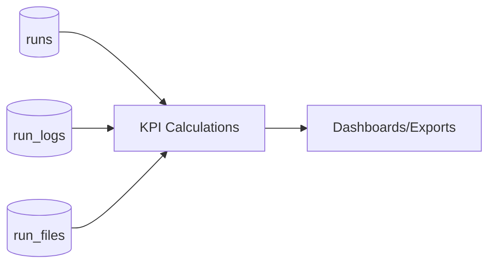

# KPI Definitions

## 1. Execution KPIs
- **Total Runs**: count of rows in `runs` for period.
- **Success Rate**: `completed_runs / total_runs * 100`.
- **Failure Rate**: `failed_runs / total_runs * 100`.
- **Cancellation Rate**: `cancelled_runs / total_runs * 100`.
- **Average Duration**: average of `end_time - start_time` for completed runs.

## 2. Throughput KPIs
- Runs per automation per day/week.
- Runs per project and site.
- Active users launching runs per period.

## 3. Reliability KPIs
- P95 time to first log entry.
- P95 completion time by automation.
- Output publication lag after completion.

## 4. Quality KPIs
- Rerun ratio per automation.
- Repeat failure rate for same workflow/input pattern.

## 5. KPI Pipeline Diagram

