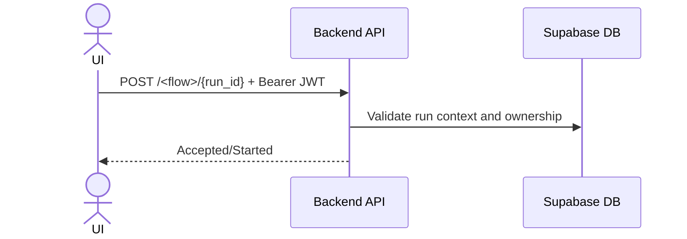

# API Contracts (UI-Observed)

## 1. Scope
This document captures backend endpoints currently invoked by frontend code (`src/pages/*`, `src/lib/backendApi.ts`).

## 2. Auth Model
- Header: `Authorization: Bearer <supabase_access_token>`
- Caller: authenticated UI session
- Expected backend behavior: verify token and authorize operation for current user

## 3. Endpoint Inventory
| Endpoint | Method | Used By | Purpose |
|---|---|---|---|
| `/run/{id}` | POST | PL Conso | Start PL Conso run |
| `/run/{id}/rerun` | POST | PL Conso | Rerun PL Conso |
| `/run/{id}/logs` | GET | PL Conso | Read run logs |
| `/input-run/{id}` | POST | PL Input | Start PL Input run |
| `/input-run/{id}/rerun` | POST | PL Input | Rerun PL Input |
| `/pdp-run/{id}` | POST | PDP Conso | Start PDP run |
| `/pdp-run/{id}/rerun` | POST | PDP Conso | Rerun PDP |
| `/pp-run/{id}` | POST | PP Conso | Start PP run |
| `/pp-run/{id}/rerun` | POST | PP Conso | Rerun PP |
| `/runs/{id}/cancel` | POST | All workflows | Cancel run |
| `/run/{id}/ai-report-pdf` | GET | Analytics | Download AI report PDF |

## 4. Canonical Request Pattern
```http
POST /run/{id}
Authorization: Bearer <jwt>
Content-Type: application/json
```

Most start/rerun/cancel endpoints are called without body.

## 5. Error Contract Expectations
- `2xx`: operation accepted/successful
- non-`2xx`: UI surfaces backend response text as error

## 6. Integration Sequence Diagram


## 7. Contract Governance Recommendations
- Publish OpenAPI (internal only) and version it.
- Add backward-compatibility policy for endpoint and payload changes.
- Add smoke tests that validate endpoint availability and auth behavior.
