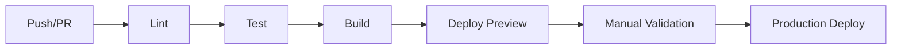

# Development Guide

## 1. Local Setup
1. Install Node.js (LTS recommended).
2. Install dependencies:
```bash
npm install
```
3. Configure env vars:
- `VITE_SUPABASE_URL`
- `VITE_SUPABASE_PUBLISHABLE_KEY`
- `VITE_BACKEND_URL`
4. Start dev server:
```bash
npm run dev
```

## 2. Common Commands
```bash
npm run dev
npm run build
npm run preview
npm run test
npm run lint
```

## 3. Code Organization
- `src/pages`: route-level views
- `src/components`: reusable UI/layout components
- `src/hooks`: shared logic (`useAuth`, etc.)
- `src/lib`: helpers (`backendApi`, sanitize helpers, types)
- `supabase/migrations`: schema and policy evolution
- `supabase/functions`: edge functions

## 4. Branch and PR Standards
- Keep changes small and domain-focused.
- Include doc updates when behavior/schema/policy changes.
- Prefer migration files over manual DB drift.
- PR must include:
  - what changed
  - why
  - test/verification notes
  - rollback considerations

## 5. DB Migration Workflow
1. Add new migration under `supabase/migrations`.
2. Ensure idempotence where feasible (`IF NOT EXISTS`, defensive drops).
3. Verify RLS impact and role access after migration.
4. Update docs:
- platform architecture
- access control matrix
- data dictionary

## 6. Testing Strategy (Developer Level)
- Unit tests for pure logic where feasible.
- Manual validation for workflow pages:
  - run creation
  - cancellation
  - rerun
  - output download
- Admin flow checks:
  - role update
  - file upload/download
  - analytics filters

## 7. CI/CD Quality Gates (Recommended)


## 8. Known Engineering Gaps
- `create-user` edge function is malformed and should be fixed before release.
- Supabase generated types are out of sync with current run fields.
