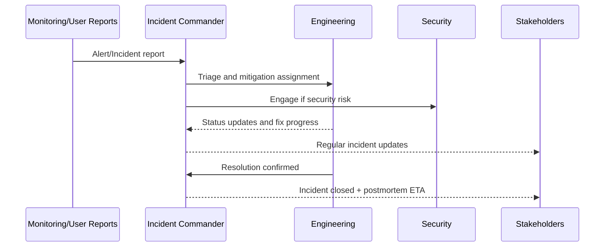

# Incident Response Guide

## 1. Severity Model
- **SEV-1**: Platform unavailable or security breach.
- **SEV-2**: Core workflow unavailable for subset of users.
- **SEV-3**: Degraded non-critical functionality.
- **SEV-4**: Minor defects with workaround.

## 2. Incident Lifecycle
1. Detect
2. Triage
3. Mitigate
4. Resolve
5. Postmortem

## 3. Triage Checklist
- What workflow is impacted?
- Is impact global or scoped to project/site/user role?
- Is data integrity affected?
- Is security/privacy affected?

## 4. Communication Plan
- Open incident channel.
- Share status updates at fixed cadence.
- Publish closure summary with root cause and corrective actions.

## 5. Postmortem Template
- Summary
- Customer/User impact
- Timeline
- Root cause
- Contributing factors
- Corrective actions
- Preventive actions

## 6. Response Swimlane

