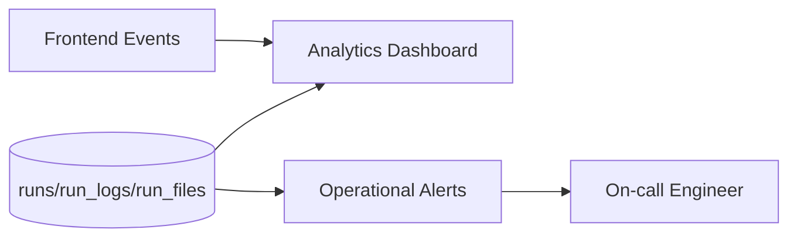

# Observability Guide

## 1. What to Observe
- Run volume by automation slug
- Success/failure/cancelled distribution
- Duration distribution by workflow
- Log volume and error-level spikes
- Storage output production trends

## 2. Primary Data Sources
- `runs`
- `run_logs`
- `run_files`
- analytics pages and exported CSV

## 3. Alerting Recommendations
- Spike in failed runs beyond threshold
- Elevated pending duration (stuck queue indicator)
- Missing output file after completion
- Admin function error rate spikes

## 4. Debug Query Examples
- Recent failed runs grouped by automation
- Runs with completion but no output record
- Long-running active runs

## 5. Telemetry Topology

