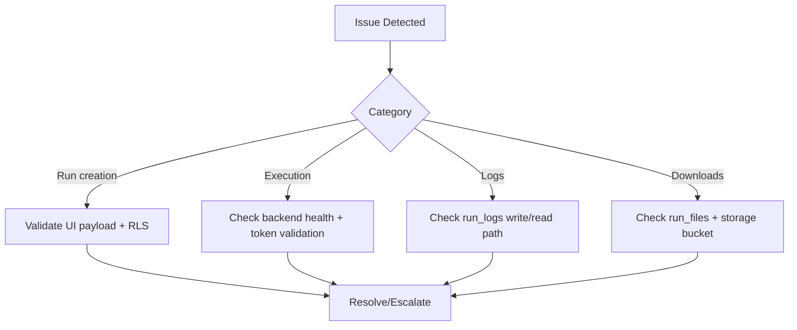

# Operations Runbooks

## 1. Run Submission Fails
Symptoms:
- Run row not created.
- UI toast with insert or validation error.

Checks:
1. Confirm authenticated session exists.
2. Validate required file selections for selected automation.
3. Verify `runs` insert policy allows caller.
4. Verify `automation_slug` value is in allowed constraint set.

## 2. Run Stuck in Pending
Symptoms:
- `runs.status = pending` for extended time.

Checks:
1. Confirm backend start endpoint was called.
2. Validate backend availability and auth verification.
3. Verify backend can access DB and update run status.

## 3. No Logs Visible
Checks:
1. Confirm backend writes to `run_logs`.
2. Confirm `run_id` is correct.
3. Confirm caller visibility under RLS (owner/admin).

## 4. Download Fails
Checks:
1. Confirm `run_files` row exists with `file_type = FINAL_OUTPUT`.
2. Confirm storage path exists in expected bucket.
3. Confirm bucket policy includes authenticated read.

## 5. Admin User Action Fails
Checks:
1. Confirm caller is admin.
2. Confirm edge function deployment is healthy.
3. Confirm service role secrets are configured for function.

## 6. Operational Decision Flow

