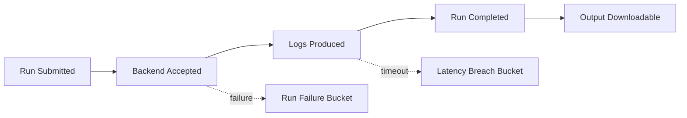

# SLO/SLI and Reliability

## 1. Proposed Service Level Indicators (SLIs)
- Run submission success rate
- Run completion success rate
- P95 time to first log event
- P95 time from completion to downloadable output
- Admin operation success rate (role change, password reset, disable)

## 2. Proposed SLO Targets
- Run submission success: >= 99.5%
- Run completion success: >= 97.0%
- P95 first-log latency: <= 120 seconds
- Output availability after completion: <= 60 seconds (P95)

## 3. Error Budget Policy
- Monthly error budget based on SLO target.
- Exhaustion triggers change freeze for non-critical releases.

## 4. Reliability Model Diagram

