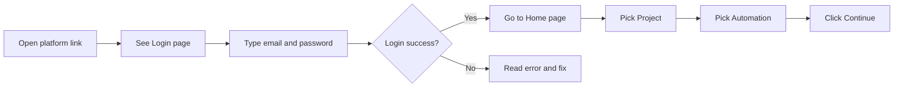

# Platform Access Manual (Very Simple Step-by-Step)

## 1. What This Is
This guide helps you:
- open the platform
- log in
- go to the correct page
- fix common login/access problems

If you can use email and click buttons, you can use this guide.

## 2. Before You Start (Must Have)
You need all of these:
1. A work email ending with:
- `@merkle.com`
- `@dentsu.com`
2. A platform account (created already or by admin)
3. Internet connection
4. A browser (Chrome, Edge, Safari, or Firefox)

If any one is missing, access may fail.

## 3. Fast Overview

## 4. First Time Ever? Do This
If you do not have an account yet:
1. Open platform link.
2. On login page, click `Don't have an account? Sign up`.
3. Fill:
- Full Name
- Email
- Password (at least 6 characters)
4. Click `CREATE ACCOUNT`.
5. Go back to login mode.
6. Login with same email/password.

If sign-up does not work:
- Ask platform admin to create your user.

## 5. Daily Login (Normal Use)
1. Open platform URL.
2. You should see `SIGN IN`.
3. Enter your work email.
4. Enter your password.
5. Click `LOGIN`.
6. Wait a few seconds.
7. If successful, you land on Home page.

You are done with login.

## 6. What You Should See After Login
On Home page:
- one dropdown for `Project`
- one dropdown for `Automation`
- one `Continue` button

### Next steps
1. Select a Project.
2. Select an Automation:
- PL Conso Automation
- PL Input Creation Automation
- PDP Conso Automation
- AE PP Conso Automation
3. Click `Continue`.

Now you are inside that automation page.

## 7. Simple Access Rules

### Standard User can:
- login
- run automations
- see own/team run history (as allowed)
- download allowed output files
- see analytics page (`/analytics`)

### Admin can do everything above, plus:
- manage users
- manage files
- view admin analytics
- view audit log
- review user feedback

If you are not admin, admin pages will not open.

## 8. Logout (Very Important on Shared Laptop)
1. Click your profile picture/icon in top-right corner.
2. Click `Sign out`.
3. Confirm you are back on Login page.

Always do this on shared computers.

## 9. Common Problems and Exact Fix

## 9.1 Message: “Only @merkle.com and @dentsu.com emails are allowed”
What it means:
- Email domain is not allowed.

Fix:
1. Check your email typing.
2. Use your company email only.

## 9.2 “Invalid login credentials”
What it means:
- Email or password is wrong.

Fix:
1. Re-type email carefully.
2. Re-type password carefully.
3. Make sure Caps Lock is OFF.
4. If still failing, ask admin to reset/help.

## 9.3 You login, then it sends you back to Login again
What it means:
- Session token expired or browser session issue.

Fix:
1. Close tab.
2. Open platform again.
3. Login again.
4. If still failing, clear browser cache/cookies for this site and retry.

## 9.4 “Access denied” on admin pages
What it means:
- Your account is not admin.

Fix:
1. Ask admin to grant admin role (if needed for your job).

## 9.5 Account disabled
What it means:
- Admin disabled your account.

Fix:
1. Contact admin and request re-enable.

## 10. If You Get Stuck (Copy This and Send to Admin)
Send this info:
1. Your email ID
2. Date + time of issue
3. Exact page URL
4. Screenshot of error
5. What you clicked before error (step by step)

This helps support fix faster.

## 11. Best Practices (Easy Security)
1. Do not share password.
2. Do not share session/token.
3. Logout on shared laptops.
4. Use strong password.
5. Report suspicious activity quickly.

## 12. Super Short FAQ

### Q: Can I use Gmail/Yahoo/personal email?
No. Only `@merkle.com` or `@dentsu.com`.

### Q: I cannot see admin menu. Is this a bug?
Usually no. You likely have standard user role.

### Q: Who can create my account?
Platform admin.

### Q: Why did I get logged out automatically?
Session expired. Login again.

## 13. One-Page Quick Checklist
- [ ] I have work email (`@merkle.com` or `@dentsu.com`)
- [ ] I know my password
- [ ] I can open platform URL
- [ ] I can login and see Home page
- [ ] I can choose Project + Automation
- [ ] I can click Continue
- [ ] I know how to logout
- [ ] I know who to contact if access fails

## 14. Support Contact
Primary support:
- Platform administrator or project owner

When contacting support, include details from Section 10.
