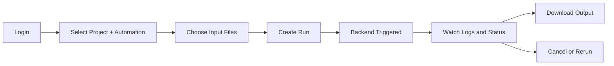

# Product Requirements Document (PRD)

## 1. Problem Statement
Automation teams need a single internal platform to launch and track PL/PDP/PP automation workflows with auditability, access control, and download management.

## 2. Product Vision
Provide a secure, role-aware operations cockpit that standardizes run submission, monitoring, cancellation, reruns, and output retrieval.

## 3. Personas
- Automation Analyst: submits runs, monitors progress, downloads outputs.
- Team Lead: monitors team performance and run quality.
- Platform Admin: manages users, files, analytics, and audit trails.

## 4. Goals
- Reduce manual run orchestration effort.
- Improve traceability of run activity and outputs.
- Enforce role-based permissions and secure storage access.
- Centralize run analytics across automations.

## 5. Non-Goals
- Replacing the processing backend engine.
- Acting as a generalized workflow orchestration platform.
- Public anonymous access.

## 6. Functional Requirements
1. Authentication with enterprise domain restrictions.
2. Launch workflows: `pl-conso`, `pl-input`, `pdp-conso`, `pp-conso`.
3. Track run status, progress, timestamps, and logs.
4. Support run cancellation and rerun.
5. Download workflow outputs by automation type.
6. Capture user feedback and optional attachments.
7. Admin: manage users, role assignments, and account states.
8. Admin: upload/manage source files required by workflows.
9. Admin: inspect audit logs and aggregate analytics.

## 7. Non-Functional Requirements
- Security: strict RLS and private storage buckets.
- Reliability: clear run state transitions and restart/cancel semantics.
- Performance: dashboard queries complete under target latency thresholds.
- Maintainability: migration-driven schema and policy changes.

## 8. Success Metrics
- Run success rate by automation.
- Median run turnaround time.
- Failed/cancelled run rate trend.
- Time-to-download after completion.
- Number of security policy violations (target: zero).

## 9. User Journey Diagram

## 10. Risks
- Backend API contract drift from frontend expectations.
- Schema/type drift between migrations and generated client types.
- Route guard misconfiguration (user pages admin-only).

## 11. Open Questions
- Should profile and feedback pages be user-accessible for all authenticated users?
- What is the long-term canonical API specification source?
