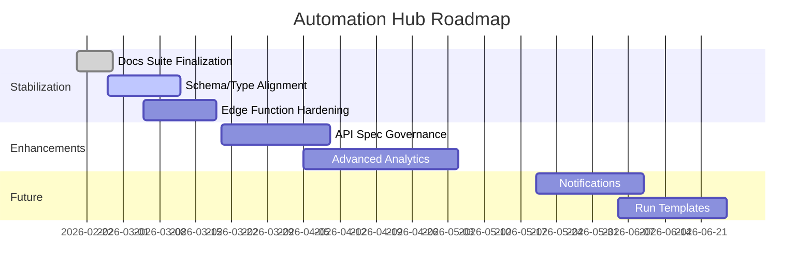

# Product Roadmap

## Horizon View

### Now (0-1 month)
- Stabilize current run flows across all automations.
- Fix schema/type drift and edge function deployability.
- Finalize documentation baseline and ownership.

### Next (1-3 months)
- Add backend API schema documentation and versioning.
- Add richer analytics slices (by project/site/automation/owner).
- Improve run diagnostics and error surface in UI.

### Later (3-6 months)
- Workflow templates and saved run configurations.
- Notifications for run completion/failure.
- Governance dashboards (security and compliance posture).

## Milestone Diagram

## Dependencies
- Backend team publishing stable endpoint contract.
- Supabase migration discipline and schema ownership.
- Security review sign-off on policy updates.
