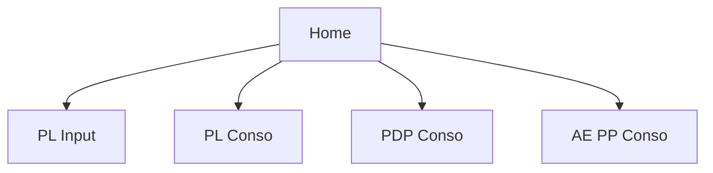

# User Guide

## 1. Accessing the Platform
1. Open the application URL.
2. Sign in using `@merkle.com` or `@dentsu.com` email.
3. Select project and automation from Home.

## 2. Running an Automation
1. Navigate to one of:
- PL Conso
- PL Input
- PDP Conso
- AE PP Conso
2. Select project, site, scope.
3. Select required files for that workflow.
4. Click Run.
5. Monitor status and logs.

## 3. Managing Runs
- **Refresh** to fetch latest status.
- **Rerun** to re-trigger processing.
- **Cancel** to stop active/incomplete runs.

## 4. Downloading Outputs
1. Open `Downloads`.
2. Filter by automation/site/user/date as needed.
3. Click file name or download icon.

## 5. Feedback
1. Open `Feedback`.
2. Choose subject and message.
3. Optionally attach file.
4. Submit.

## 6. Admin Functions
Admins can access:
- User Management
- File Management
- Admin Analytics
- Audit Log
- Feedback Review

## 7. Workflow Selection Diagram

