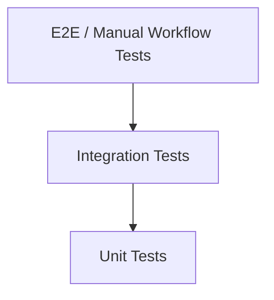

# Test Strategy

## 1. Objectives
- Ensure all automation workflows can be launched, monitored, cancelled, rerun, and downloaded reliably.
- Prevent regressions in auth, role gating, and security controls.

## 2. Test Layers
- Unit tests: utility and pure logic.
- Integration tests: page-level behavior with Supabase interactions mocked/stubbed where feasible.
- End-to-end/manual: run lifecycle and admin operations.

## 3. Critical Test Areas
1. Authentication and route protection.
2. Run creation validation by workflow.
3. Backend trigger invocation and failure handling.
4. Run status/log polling and terminal state display.
5. Download mapping by `automation_slug`.
6. Admin functions (role/password/disable).
7. Feedback submission and signed attachment access.

## 4. Environment Matrix
- Local development
- Preview deployment
- Production smoke checks

## 5. Test Pyramid Diagram

## 6. Exit Criteria
- No critical or high-severity open defects.
- Core workflow smoke checks pass.
- Security-sensitive paths validated after auth/policy changes.
