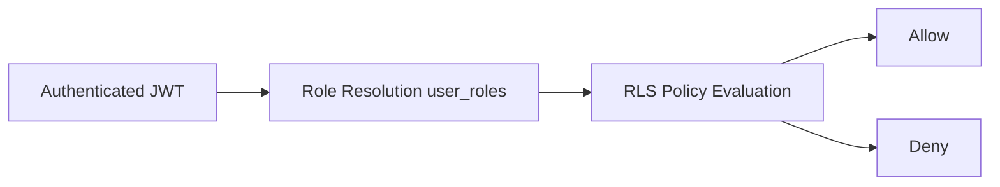

# Access Control Matrix

## 1. Role Definitions
- `user`: authenticated non-admin
- `admin`: elevated platform operator

## 2. Functional Access
| Capability | User | Admin |
|---|---|---|
| Login and view home | Yes | Yes |
| Submit own runs | Yes | Yes |
| View own runs/logs/files | Yes | Yes |
| View all runs/logs/files | No (expected) | Yes |
| Download outputs | Yes (authorized scope) | Yes |
| Submit feedback | Yes | Yes |
| View all feedback | No | Yes |
| Manage user roles | No | Yes |
| Reset password (other users) | No | Yes |
| Disable/enable user account | No | Yes |
| View audit log | No | Yes |

## 3. Data-Level Policy Intent
| Table | Select | Insert | Update | Delete |
|---|---|---|---|---|
| `profiles` | own or admin | own | own or admin | admin/system only |
| `user_roles` | own or admin | admin | admin | admin |
| `projects` | authenticated | admin | admin | admin |
| `sites` | authenticated | admin | admin | admin |
| `runs` | owner or admin | owner/admin | owner/admin | admin |
| `run_logs` | owner or admin | admin/service | admin/service | admin/service |
| `run_files` | owner or admin | admin/service | admin/service | admin/service |
| `input_files` | authenticated | admin | admin | admin |
| `audit_log` | admin | authenticated/admin | admin/system | admin/system |
| `feedback` | own or admin | own | admin | admin |

## 4. Authorization Diagram

