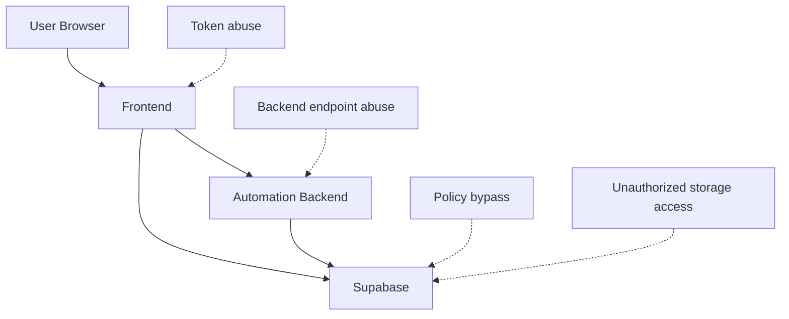

# Threat Model

## 1. Scope
Assets in scope:
- User identities and roles
- Run metadata and logs
- Input/output files in private buckets
- Admin functions and privileged operations

## 2. Trust Boundaries
1. Browser <-> Frontend app
2. Frontend <-> Supabase
3. Frontend <-> Backend API
4. Backend/API <-> Supabase privileged writes

## 3. Key Threats (STRIDE)
- Spoofing: forged/expired JWT usage
- Tampering: unauthorized run/file mutation
- Repudiation: missing audit context for admin changes
- Information disclosure: bucket/table overexposure
- Denial of service: automated run spam or abuse
- Elevation of privilege: role management bypass

## 4. Existing Controls
- Supabase Auth with JWT
- Row Level Security policies across core tables
- Private storage buckets (`public=false`)
- Role checks through `has_role()`
- XSS sanitization for profile and feedback text
- CSP and security headers at frontend edge

## 5. Threat Model Diagram

## 6. Recommended Hardening
- Fix broken `create-user` function and add tests.
- Enforce backend authz with run ownership checks.
- Add rate limiting on run-trigger endpoints.
- Add immutable audit entries for all admin mutations.
