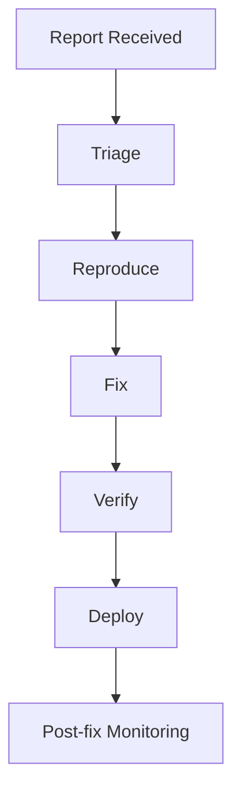

# Vulnerability Management Process

## 1. Intake
Sources:
- Internal testing
- Security audits
- Bug reports / responsible disclosure
- Dependency scanning

## 2. Triage and Classification
- Severity: Critical / High / Medium / Low
- Scope: auth, data exposure, integrity, availability
- Exploitability and business impact assessment

## 3. SLA Targets
- Critical: mitigation in 24h
- High: mitigation in 3 days
- Medium: mitigation in 14 days
- Low: next planned cycle

## 4. Response Workflow

## 5. Validation Requirements
- Regression checks for affected workflows
- Security test evidence captured in report
- Documentation updates for policy/behavior changes

## 6. Disclosure and Closure
- Communicate stakeholder impact and remediation status.
- Record root cause and preventive controls in decision log.
